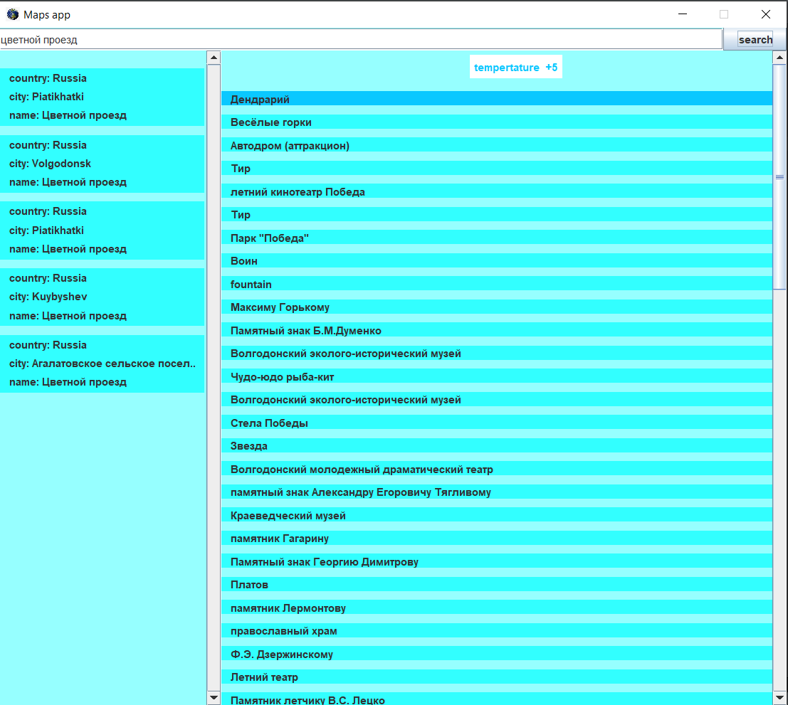

# App, which makes http requests:
1) Getting locations with coordinates and names
2) Getting the weather by coordinates
3) Getting a list of interesting places by coordinates
4) Getting a description of a place by its id

## How to launch it

Go to project folder, using terminal. Then type
```
cd network_lab3
java -jar target/detector.jar
```

The application is written on the MVC pattern, using java client, logging, fasterxml

