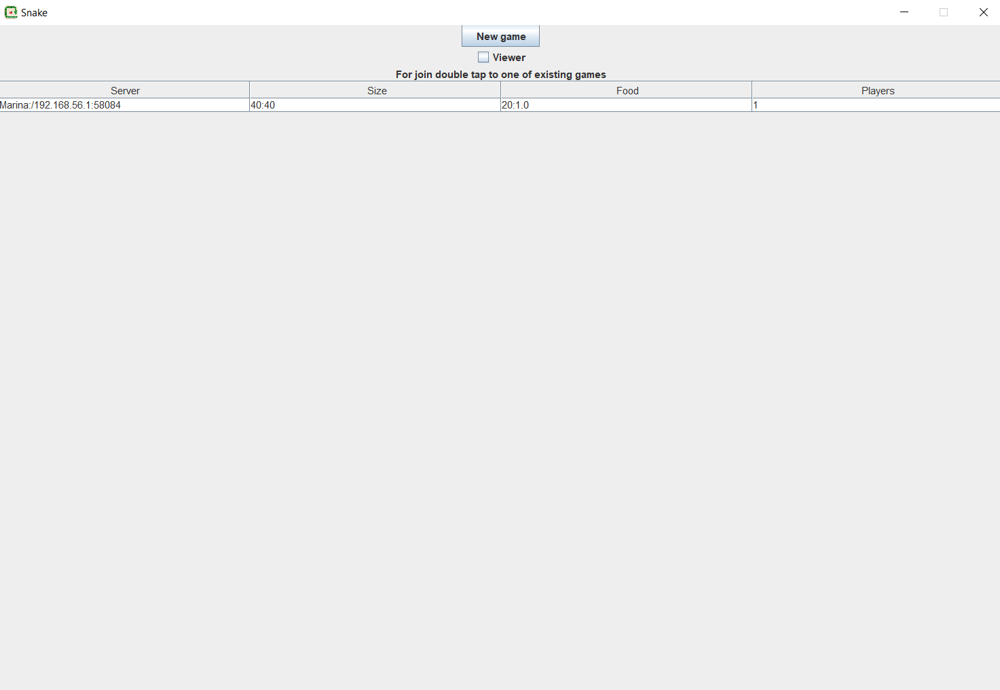
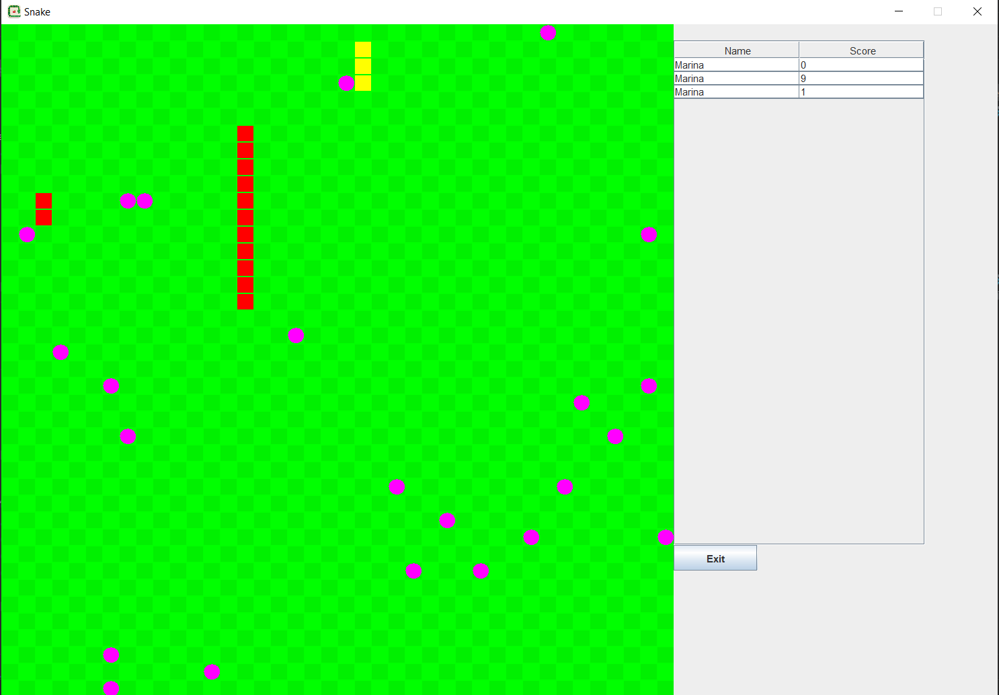

# Network snakes game

## How to launch it

Go to project folder, using terminal. Then type
```
cd network_lab4
java -jar target/detector.jar
```

The application is written on the MVC pattern, using com.google.protobuf, lombok
The application main panel:

Here you can choose one of the existing games or start own

The application game panel:

Here you can eat food with your snake, using UP, DOWN, LEFT, RIGHT computer buttons. But you can't collise with your tail and with the other snakes
